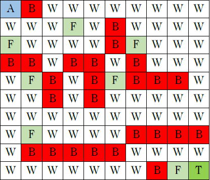

# Q-Learning-Maze-Solver-AI-Project

This project implements a Q-Learning algorithm to solve a maze navigation problem. The goal is for an agent to traverse the environment, collect all flags, and reach the target without hitting any obstacles.

## Maze Layout

The environment consists of:
- `W`: Walkable path
- `B`: Block (Obstacle)
- `F`: Flag (to be collected)
- `A`: Agent (starting position)
- `T`: Target (end goal)

## Features
- Discretized maze environment
- Agent navigation with Q-Learning
- Customizable parameters: gamma (𝛾) and alpha (𝛼)
- Analyzes the effect of varying 𝛾 and 𝛼 on the learning process
- Maze represented as a weighted graph
